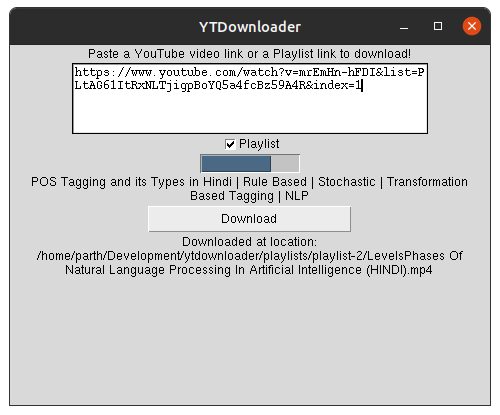

# **YTDownloader**

Download YouTube videos or Playlists using [pytube](https://pypi.org/project/pytube/) on a simple GUI.

## **Screenshot**



## **Installation**

Clone the repository, then cd to ```yt-downloader``` and run:

```bash
pip install -r requirements.txt
```

## **Usage**

```bash
python3 gui.py
```
